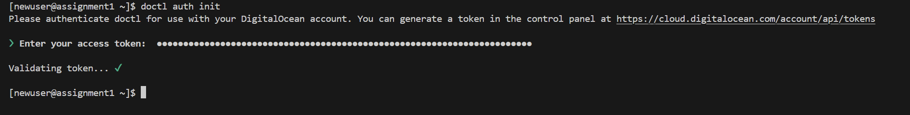
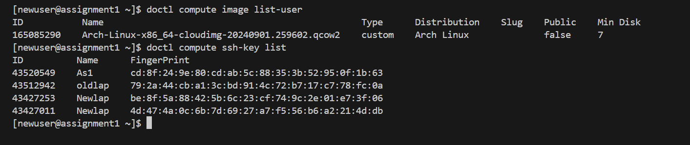
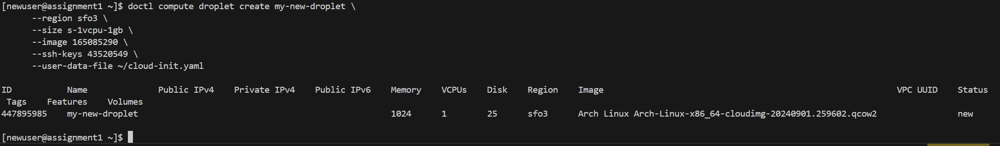

# **Level 3 Tutorial: Setting Up an Arch Linux Droplet on DigitalOcean with SSH, cloud-init, and doctl**

This guide will walk you through creating an Arch Linux Droplet on DigitalOcean with SSH key-based authentication. We’ll automate the initial setup using a `cloud-init` configuration file and also use the `doctl` command-line tool to create and manage the Droplet.

---

## **Step 1: Create SSH Keys on Your Local Machine**

To securely connect to your DigitalOcean Droplet, you first need to generate an SSH key pair.

1. Open **Terminal** on your system.

2. Generate an SSH key using the `ed25519` algorithm with the following command:

    ```bash
    ssh-keygen -t ed25519 -f ~\.ssh\yourkeyname -C "youremail@email.com"
    ```
    If you are on Windows you might want to enter the full path since PowerShell tilde expansion doesn't always work. For example:

    ```bash
    ssh-keygen -t ed25519 -f C:\Users\your-user-name\.ssh\yourkeyname -C "youremail@email.com"
    ```

   - Replace `your-user-name` with your actual Windows username.
   - Replace `yourkeyname` with the name you want your keys to have.
   - Replace `"youremail@email.com"` with your email address.

3. When prompted, either leave the passphrase blank or enter one for additional security.

    

4. Find your **public key** at `C:\Users\your-user-name\.ssh\yourkeyname.pub`. Open this file, copy its contents, and save it for later.

---

## **Step 2: Add a Custom Arch Linux Image Using the DigitalOcean Web Console**

Before creating the Droplet, you need to upload a custom Arch Linux image on DigitalOcean.

1. Go to the link bellow to download the appropriate Arch Linux image. You want the most recent "cloudimg", the ".qcow2", the date may be different. Download the most recent image. 
    https://gitlab.archlinux.org/archlinux/arch-boxes/-/packages/

2. Log into your **DigitalOcean** account and go to the **Control Panel**.

3. In the left-hand menu, navigate to **Images > Backups & Snapshots > Custom Images**.

4. Click **Upload Image** and follow the prompts.

    

---

## **Step 3: Create a cloud-init Configuration File**

A `cloud-init` configuration file helps automate server setup tasks, such as creating users, installing packages, and disabling root access via SSH.

1. On your local machine, create a new file called `cloud-init.yml` using a text editor (e.g., Notepad).

2. Add the following content:

    ```yaml
    #cloud-config
    users:
      - name: newuser
        sudo: ['ALL=(ALL) NOPASSWD:ALL']
        shell: /bin/bash
        ssh-authorized-keys:
          - ssh-ed25519 AAAAC3Nza...your_public_key_here

    packages:
      - git
      - nginx
      - python

    runcmd:
      - systemctl enable nginx
      - echo "Initialization complete!"

    ssh_pwauth: false  # Disable root login via SSH
    ```

   **Explanation**:
   - **Users**: Creates a user called `newuser` with sudo privileges and adds your public SSH key for secure access.
   - **Packages**: Installs useful packages such as `git`, `nginx`, and `python`.
   - **runcmd**: Enables the `nginx` service and prints a success message.
   - **ssh_pwauth**: Disables root access over SSH for security.

---

## **Step 4: Create a Droplet Using the DigitalOcean Web Console**

Once the Arch Linux image and cloud-init file are ready, follow these steps to create a Droplet:

1. In the DigitalOcean Control Panel, click **Create > Droplets**.

2. Choose the **San Francisco (SF03)** region.

3. Under **Choose an image**, click on the **Custom images** tab and select your Arch Linux image.

4. Set **Basic Droplet size** and choose either the **$7 Premium AMD** or **$8 Premium Intel** plan.

5. Under **Authentication**, select **SSH Key** and add the key you generated in Step 1 by click **New SSH Key** then paste your public key and give it a name.

6. In the **Hostname** section, set the hostname to something shorter like `bcit`.

7. Click on **+ Advanced Options**, and under **Add Initialization scripts**, paste the contents of your cloud-init file into the **Enter user data here...** box.

8. Click **Create Droplet**.

    

---

## **Step 5: Connect to Your Droplet Using SSH**

Once the Droplet is created, you can connect using your SSH keys:

1. Open **Terminal**.

2. Connect to your Droplet by running the following command:

    ```bash
    ssh -i C:\Users\your-user-name\.ssh\yourkeyname newuser@your-droplet-ip
    ```

   - Replace `yourkeyname` with the name of your private key.
   - Replace `your-droplet-ip` with the public IP address of your Droplet (found in the DigitalOcean control panel).

---

## **Step 6: Install and Configure doctl**

Next, you'll set up `doctl`—DigitalOcean's command-line tool—to manage your Droplet.

1. SSH into your Droplet as in Step 5.

2. You should update your system before install any software or packages. Use the command below:

    ```bash
    sudo pacman -Syu
    ```

3. After updating you can install some packages and their dependencies (software they need to run):

    ```bash
    sudo pacman -S bash-completion git less man-db neovim
    ```

2. Now install `doctl` with this command:

    ```bash
    sudo pacman -S doctl
    ```

3. Authenticate `doctl` with your DigitalOcean account:

    ```bash
    doctl auth init
    ```

   You’ll need to generate a DigitalOcean API token from the DigitalOcean control panel. Copy the token and paste it when prompted.

    

4. Verify `doctl` is working:

    ```bash
    doctl account get
    ```

   If it works, you should see your DigitalOcean account details.

---
## **Step 7: Create a cloud-init file using a text editor (foe eg. vim)**

1. Use the following command to create and edit a new  `cloud-init` file:
    
    ```bash
    nvim cloud-init.yaml
    ```

2. After the file created, you paste the contents of the cloud-init file that we created previously in step 3 to the new file.

3. Exit editing mode by pressing **escape**, save and quit the file by typing **:wq** then press **ENTER**.  


## **Step 8: Create a New Droplet Using doctl and cloud-init**

Now that `doctl` is configured, use it to create a new Droplet:

1. Find your Arch Linux image ID with the following command:

    ```bash
    doctl compute image list-user
    ```
    Copy and save it for later steps

2. Find your SSH Key ID with the following command:

    ```bash
    doctl compute ssh-key list
    ```
    Copy and save it for next step

    

3. Use the following command to create a new Droplet with your Arch Linux image and the `cloud-init` file:

    ```bash
    doctl compute droplet create my-new-droplet \
      --region sfo3 \
      --size s-1vcpu-1gb \
      --image your-arch-linux-image-id \
      --ssh-keys your-ssh-key-id \
      --user-data-file ~/cloud-init.yaml
    ```

   - Replace `your-arch-linux-image-id` with your Arch Linux image ID.
   - Replace `your-ssh-key-id` with your SSH key ID.

   - Region: sfo3 (San Francisco).
   - Size: Select the size based on your needs (e.g., s-1vcpu-1gb).
   - SSH Keys: Use your previously created SSH key ID.
   - User Data File: Points to your cloud-init file to automate server setup

    

4. After creation, you can connect to this new Droplet using the same SSH method as before.

---

## **Conclusion**

By following these steps, you’ve successfully created and managed an Arch Linux Droplet on DigitalOcean, using both the web console and `doctl`. You’ve also automated the initial setup with a `cloud-init` configuration file for secure and efficient server management.
